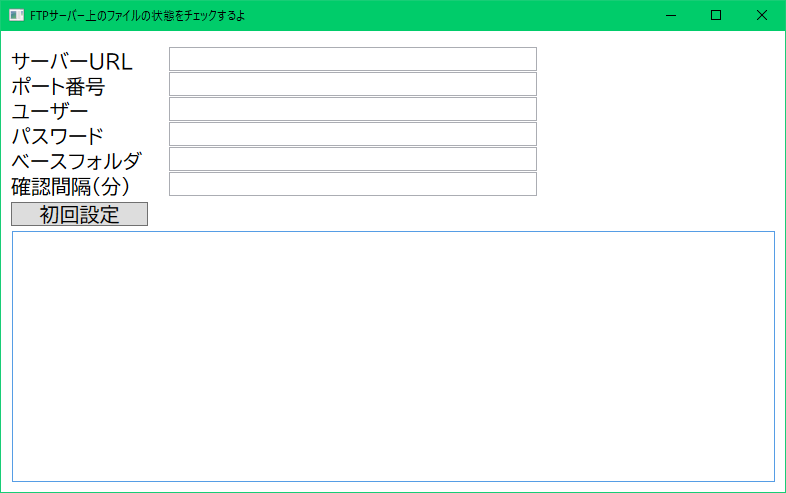
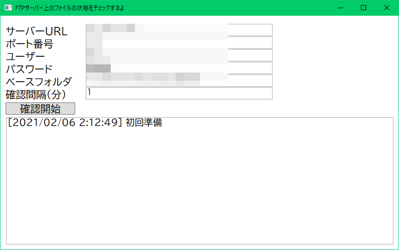
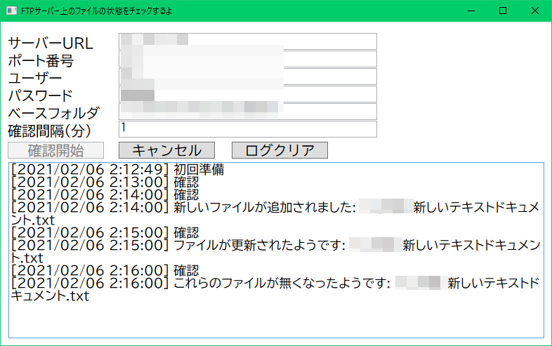
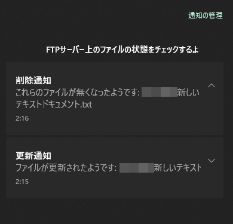

# FTPCheck

FTPサーバー上のファイルの状態をチェックします。  
通知対象は以下。

- ファイルが追加された
- ファイルが更新された
- ファイルが削除された

**ただし、WindowsServer上に構築されたFTPサーバーでしか機能しません。**  
Linuxやその他で構築されたFTPサーバー上では正しく動作しないと思います。

### 使用方法

- サーバーURL
  - FQDNもしくはIPアドレスを入力
- ポート番号
  - ポート番号を入力
- ユーザー
  - FTP のユーザーを入力
- パスワード
  - FTP のパスワードを入力
- ベースフォルダ
  - 監視したいフォルダを指定
  - フォルダの区切り文字はスラッシュ
    - e.g.) /path/to/target
- 確認間隔（分）
  - 何分おきに確認するかを入力

「初回設定」 を押すと、ベースディレクトリを再帰的にチェックしてファイルの情報をキャッシュします。

「確認開始」を押すと、チェックが開始されます。

ファイルの追加、更新、削除を検知すると、ログに表示されます。  
追加、更新、削除の通知は、デスクトップ通知も行われるためアクションセンターに表示されます。

